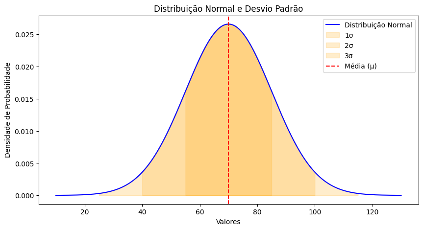

# Distribuição Gaussiana


Esse repositório tem como objetivo registrar os estudos sobre a Distribuição Gaussiana, ou Distribuição Normal.

_"A distribuição normal é um modelo bastante útil na estatística, e não seria uma surpresa pois a soma de efeitos independentes (ou efeitos não muito correlacionados) deveriam, se houvesse muitos desses, se distribuir normalmente (sempre sujeito a certos pressupostos)."_

ZIBETTI, André

A distribuição normal possui dois parâmetros, a média ($μ$), ou seja onde está centralizada e a variância ($σ^2>0$) que descreve o seu grau de dispersão. Ainda, é comum se referir a dispersão em termos de unidades padrão, ou seja desvio padrão ($σ$). Cabe salientar que como qualquer outro modelo, dependendo dos parâmetros, teremos diferentes distribuições normais.
É importante lembrar que a variável $X$ se distribui de forma contínua (variável contínua) de $−∞<x<+∞−∞<x<+∞$ e a área total sob a curva do modelo é unitária (ou seja 1).

**Parâmetros :**

- μ é a média da distribuição
- σ2 é a varIância da distribuição
- σ é o desvio padrão da distribuição, note que

A variância pode ser observada no gráfico de distribuição normal, entendendo que:

- **68% dos dados** estão entre **μ−σ  e μ+σ**
- **95% dos dados** estão entre **μ−2σ e μ+2σ**
- **99.7% dos dados** estão entre **μ−3σ e μ+3σ**

O código a seguir (gerado por IA) representa, em tons de laranja, como os dados estão em relação à variância, se adequando perfeitamente à regra.

```python
import numpy as np
import matplotlib.pyplot as plt

# Definir média e desvio padrão
mu = 70  # Exemplo: peso médio de 70kg
sigma = 15  # Exemplo: desvio padrão de 15kg

# Criar os valores do eixo X
x = np.linspace(mu - 4*sigma, mu + 4*sigma, 1000)

# Calcular a FDP (Curva Gaussiana)
y = (1 / (sigma * np.sqrt(2 * np.pi))) * np.exp(-0.5 * ((x - mu) / sigma) ** 2)

# Plotar a curva
plt.figure(figsize=(10, 5))
plt.plot(x, y, label="Distribuição Normal", color='b')

# Destacar as regiões de 1, 2 e 3 desvios-padrão
for i in range(1, 4):
    plt.fill_between(x, y, where=((x >= mu - i * sigma) & (x <= mu + i * sigma)), 
                     alpha=0.2, label=f"{i}σ", color='orange')

# Adicionar linha para a média
plt.axvline(mu, color='r', linestyle='dashed', label="Média (μ)")

# Adicionar labels e legenda
plt.xlabel("Valores")
plt.ylabel("Densidade de Probabilidade")
plt.title("Distribuição Normal e Desvio Padrão")
plt.legend()
plt.show()
```

